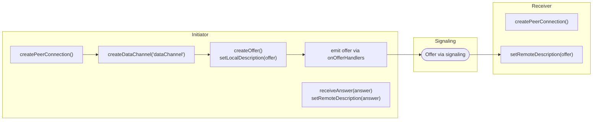
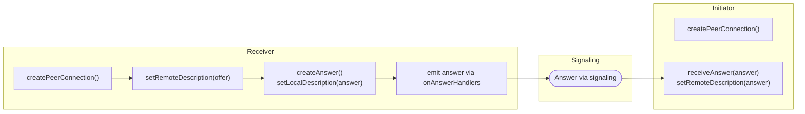
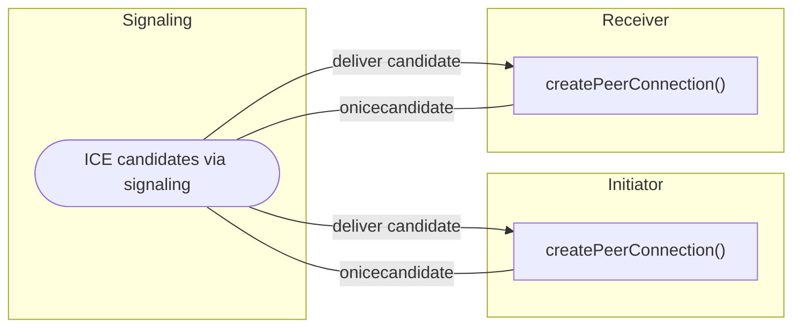
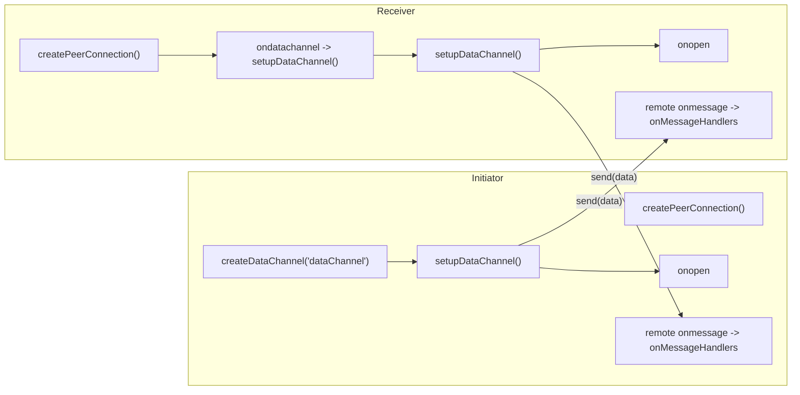
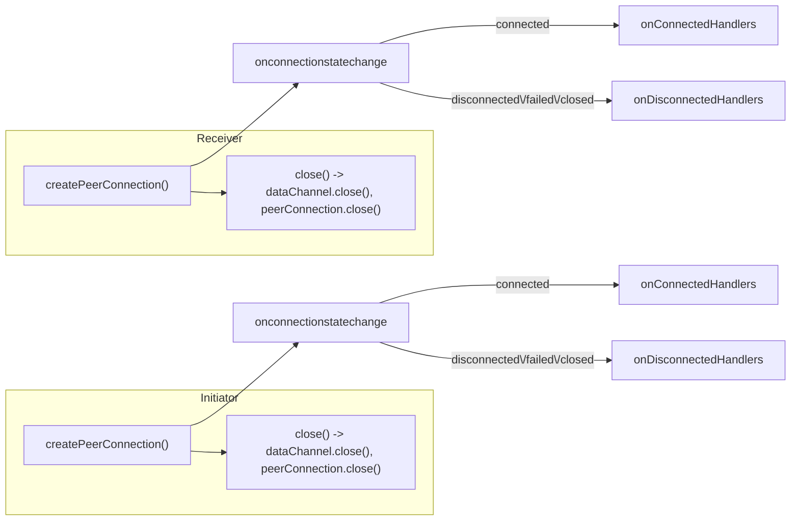

#### Chart 1 — Offer creation (Initiator → Receiver)
- The Initiator calls `createPeerConnection()` and creates a data channel with `createDataChannel('dataChannel')`.
- The Initiator generates an SDP offer with `createOffer()` and applies it locally with `setLocalDescription(offer)`.
- The offer is emitted via the project's signaling handlers (shown as `onOfferHandlers`) and transmitted to the Receiver.
- The Receiver receives the offer and calls `setRemoteDescription(offer)` so its `RTCPeerConnection` knows the Initiator's parameters.

#### Chart 2 — Answer creation (Receiver → Initiator)
- The Receiver creates its `RTCPeerConnection()` and sets the incoming offer as its remote description (`setRemoteDescription(offer)`).
- The Receiver creates an SDP answer via `createAnswer()` and applies it with `setLocalDescription(answer)`.
- The answer is emitted through signaling (`onAnswerHandlers`) back to the Initiator.
- The Initiator receives the answer and calls `setRemoteDescription(answer)` to finalize the SDP handshake.

#### Chart 3 — ICE candidate exchange
- Both peers listen for `onicecandidate` events from their `RTCPeerConnection`.
- When a candidate is discovered it is sent over the signaling channel (`ICE candidates via signaling`) to the remote peer.
- Each peer receives candidates via signaling and adds them to their `RTCPeerConnection` so ICE can establish the best transport path.

#### Chart 4 — Data channel setup & messaging
- Initiator-created `dataChannel` triggers local setup (`setupDataChannel()`).
- On the Receiver side, `ondatachannel` is fired when the remote data channel arrives; the Receiver runs its own `setupDataChannel()`.
- After setup, both sides see an `onopen` event when the data channel is ready.
- Either side can `send(data)` and the opposite side receives it via `onmessage`, which is forwarded to app-level `onMessageHandlers`.

#### Chart 5 — Connection state & cleanup
- Each `RTCPeerConnection` reports lifecycle changes via `onconnectionstatechange`.
- When the state becomes `connected`, the corresponding `onConnectedHandlers` are invoked.
- If the state becomes `disconnected`, `failed`, or `closed`, `onDisconnectedHandlers` run to handle cleanup.
- Calling `close()` should close both the `dataChannel` and the `peerConnection` to free resources and terminate the session.

